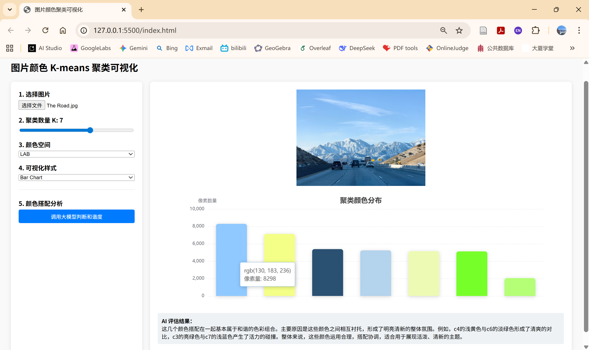

# DataVis_HW1——图片颜色聚类可视化
## 王业涵 &nbsp;10245102458  

###  一、项目简介  
本项目是一个基于 Web 的图片颜色分析工具，能够自动提取图片中的主要色彩，并通过 API 调用 LLM，使其对颜色搭配的和谐度进行评价。

---

### 二、技术栈
- **前端**: HTML, CSS, JavaScript
- **可视化库**: Apache ECharts
- **后端**: Python 3.10, FastAPI
- **算法**: K-means 聚类
- **LLM**: GPT-3.5-Turbo
---

### 三、项目结构  
```
DataVis_HW1
    ├── .env
    ├── index.html
    ├── main.py
    ├── README.md
    └── requirements.txt 
```  
---

### 四、核心功能
1. **基础要求实现**
   - 颜色聚类: 实现 K-means 聚类算法，支持 $K \geq 5$；
   - 多维可视化: 使用 ECharts 展示聚类中心的 RGB 均值及像素数量；
   - 图表展示: 支持和柱状图和饼图的动态渲染。

2. **进阶要求实现**
   - 动态交互: 支持用户自定义上传图片、实时调节 $K (2 \le K \le 10)$ 值；
   - 多空间转换: 支持在 RGB 与 LAB 颜色空间下执行聚类；
   - 前后端分离架构: 为了保护 API Key 的安全，项目采用了后端代理模式。前端不直接暴露敏感信息，调用模型的请求由 FastAPI 后端转发；
   - AI 智能评估: 结合 LLM 对提取的颜色组合进行审美分析，并给出具体的色彩改进建议；
   - 工程规范: 使用 `.env` 管理环境变量，并配置 CORS 跨域处理机制；  
   - 在线演示：构建 [https://visionnext100.github.io/](https://visionnext100.github.io/) 作为静态展示窗口。如需查看源码仓库，请访问 [https://github.com/VisionNext100/VisionNext100.github.io](https://github.com/VisionNext100/VisionNext100.github.io)。
```
GitHub Pages 仅作前端静态功能展示。色彩分析功能因涉及 API 密钥安全，需克隆本仓库并在本地启动 FastAPI 后端方可体验。
```
---

### 五、算法思想
1. **降采样处理**: 对原始像素数据进行步长采样，在不影响聚类精度的前提下提升计算速度。
2. **K-means 迭代**: 
   - 随机初始化 $K$ 个质心；
   - 迭代计算每个像素点到质心的欧氏距离；
   - 更新质心为簇内颜色的均值。
3. **空间转换**: 
   - RGB 转 LAB：通过 XYZ 中间空间进行 D65 标准转换；
   - LAB 转 RGB：将聚类中心还原为可显示的色彩值。  
---

### 六、快速复现
1. **后端启动**
    - 安装依赖: `pip install -r requirements.txt`；
    - 配置密钥: 在 `.env` 文件中填入 `OPENAI_API_KEY`；
    - 运行服务: 在终端输入`uvicorn main:app --reload`，默认运行在 [http://127.0.0.1:8000](http://127.0.0.1:8000)。

2. **前端运行**
   - 使用 VS Code 的 Live Server 插件打开 `index.html`；
   - 确保前端访问地址为 [http://127.0.0.1:5500](http://127.0.0.1:5500) 以通过 CORS 验证。  
---  
### 七、作品截图
<div align="center">
    
    <br>
    <em>图1：ECharts 可视化结果与 Anaconda 终端日志（聚类数：5，颜色空间：RGB，可视化样式：Pie Chart）</em>
</div>  
<br>
<div align="center">
    
    <br>
    <em>图2：ECharts 可视化结果全屏展示（聚类数：7，颜色空间：LAB，可视化样式：Bar Chart）</em>
</div>
